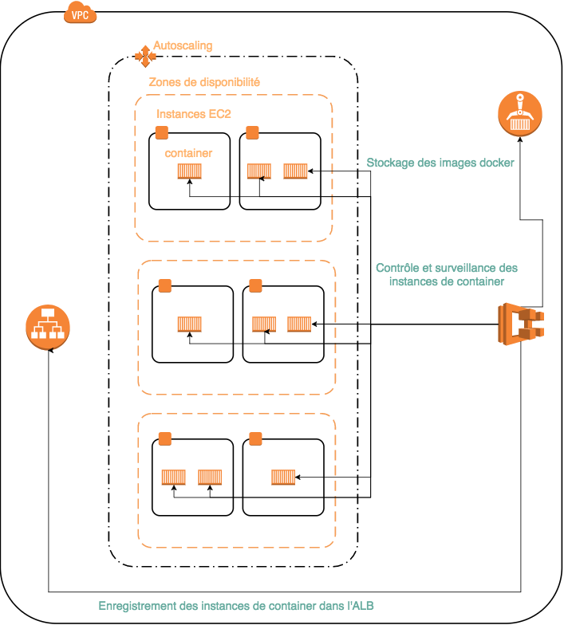
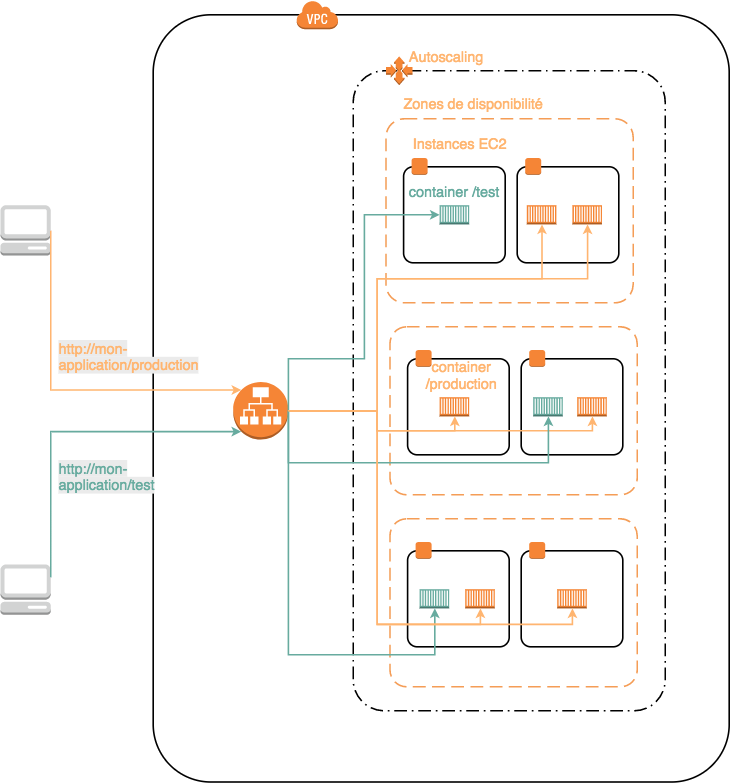

# matinale-tech

Le but de la démonstration de cette matinale technique est d'avoir un apercu des services que peuvent
rendre automatisation, container et orchestrateurs pour la phase de mise en production.

Nous avons donc un petit applicatif pour lequel on va réaliser une montée de version avec une variante du déploiement [blue/green](https://martinfowler.com/bliki/BlueGreenDeployment.html).

Le déploiement va se dérouler de la facon suivante :

- Enregistrement dans un store privé de la nouvelle version de l'applicatif
- Déploiement de cette version sur le meme cluster que la version en production mais accessible uniquement
 a partir d'un chemin alternatif. Les utilisateurs finaux n'y ont pas accès.
- Test de cette nouvelle version.
- Correction de cette nouvelle version.
- Mise à disposition des utilisateurs finaux de la nouvelle version corrigée.
  
Le tout sans aucun impact utilisateur (pas de deconnexion, pas de periode de maintenance, pas de ralentissement) et en
pouvant valider directement une nouvelle version en conditions réelles.

## Architectures et technologies

### Les outils

Nous utilisons une infrastructure hébergé sur [AWS](https://aws.amazon.com/), automatiquement provisionnée et configurée à l'aide 
de [terraform](https://www.terraform.io/).
 
L'applicatif sera packagé en tant qu'image [Docker](https://www.docker.com/). L'orchestrateur de container sera celui
 fourni par AWS en tant que service managé, [ECS](https://aws.amazon.com/fr/documentation/ecs/).

### Architecture AWS

Déploiement, surveillance, contrôle des services ECS et leurs enregistrements sur l'équilibreur de charge :



Routage des requetes clients vers les conteneurs :



## Mise en route

### Go
La premiere chose a faire est d'installer [Go](https://golang.org/dl/), de suivre [les instructions](https://golang.org/doc/install) et 
de cloner ce depot sous $GOPATH/src/github.com/sogilis/

### AWS
Il vous faudra ensuite utiliser un compte sur AWS. Si vous n'en avez pas, vous pouvez en
 [créer un](https://aws.amazon.com/free/?sc_channel=PS&sc_campaign=acquisition_FR&sc_publisher=google&sc_medium=english_cloud_computing_b&sc_content=aws_account_e&sc_detail=create%20aws%20account&sc_category=cloud_computing&sc_segment=85348026051&sc_matchtype=e&sc_country=FR&s_kwcid=AL!4422!3!85348026051!e!!g!!create%20aws%20account&ef_id=VTpYTAAABHU391SK:20170718132046:s).
Un fois ceci fait, 
Enfin il vous faudra créer un utilisateur avec des permissions d'administrateur et un accès par clé privé. Conservez precieusement cette le secret associé a la clé car vous ne pouvez le récupérer qu'une seule fois : lors de la création de la clé. 
 
Il vous faudra ensuite installer la [cli amazon](http://docs.aws.amazon.com/fr_fr/cli/latest/userguide/installing.html).
 
Et enfin configurer la cli au niveau [les fichiers de configuration et d'indentification](http://docs.aws.amazon.com/fr_fr/cli/latest/userguide/cli-chap-getting-started.html#cli-config-files).

.aws/config :
```.aws/config
[default]
region = eu-central-1
output = json
```

.aws/credentials :
```.aws/credentials
[terraform]
aws_access_key_id = ${MON_ID_DE_CLE}
aws_secret_access_key = ${SECRET}
region = eu-west-1
```

NOTE: les resources AWS utilisés ici sont soit gratuite (si l'on bénéficie de l'offre gratuite AWS de 12 mois) soit très peu chère.
Néanmoins, il est recommander de supprimer toute l'infrastructure a l'aide de la commande `~$ terraform destroy`

### Terraform
Terraform est l'outil utilisé pour créer toute l'infrastructure. Il est nécessaire de [l'installer](https://www.terraform.io/intro/getting-started/install.html).

Une fois ceci fait, tapez la commande `~$ terraform plan`. Si votre compte AWS, la cli AWS et terraform sont correctement installés, vous aurez
une simulation de la création de l'infrastructure.

### Docker et make
Il ne vous manque que [docker](https://store.docker.com/search?type=edition&offering=community) et [make](https://www.gnu.org/software/make/).
 
### le deploiement
Pour la créer, executer la commande `~$ terraform apply`.
Super ! votre infrastructure fonctionne. Mais aucune application ne tourne encore dessus.
Pour remedier a ca :
 - configurez la variable d'environnement AWS_DEFAULT_PROFILE : `~$ export AWS_DEFAULT_PROFILE=terraform`
 - connectez vous au repository docker privé de votre infrastructure. Pour cela, il faut coller le retour de la commande `~$ aws ecr get-login` dans le terminal et l'éxecuter
 - construisez votre image docker: `~$ make dbuild`
 - poussez la sur votre repository privé: `~$ make dpush`

Votre application est désormais déployé (compter quelque 20 - 30 secondes avant de pouvoir y acceder).
Vous pouvez obtenir le DNS du point d'entrée de l'application avec la commande `~$ terraform output entry_point_production`.

## [Suite](https://github.com/sogilis/matinale-tech/blob/version-2-failure/README.md)


Pour plus d'information vous pouvez consulter la [documentation AWS](https://aws.amazon.com/) et [terraform](https://www.terraform.io/docs/index.html)
