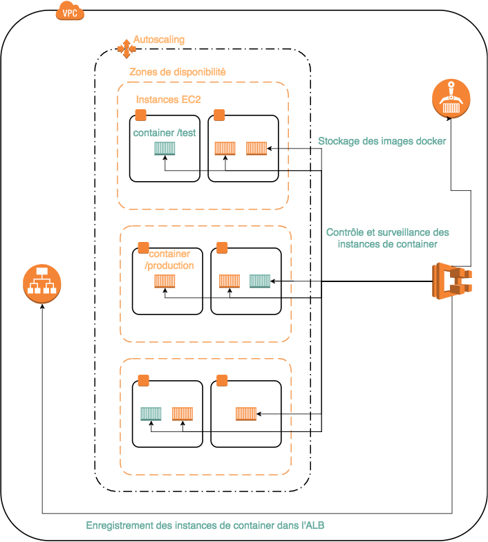

# matinale-tech

Le but de la demonstration de cette matinale technique est d'avoir un apercu des services que peuvent
rendre container et orchestrateurs pour la phase de mise en production.

## architecture

Déploiement, surveillance, contrôle des services ECS et leurs enregistrements sur le l'équilibreur de charge :

Routage des requetes clients vers les conteneurs :

